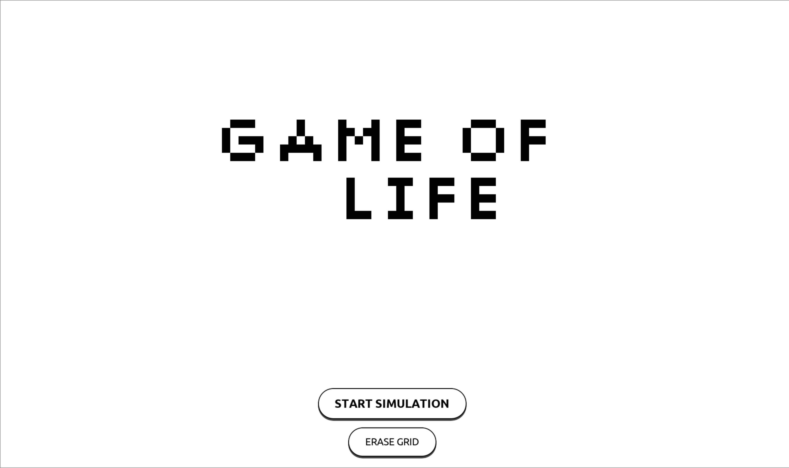
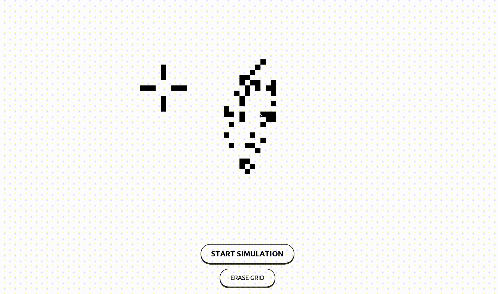

# Game Of Life in Python with Pygame

I made a **GAME OF LIFE** in python3 with Nympy and Pygame !  
If you don't know what is Game of Life, go check this [video](https://www.youtube.com/watch?v=Kk2MH9O4pXY)



## How it's work 

When you lauch the game, you can ERASE GRID or START SIMULATION. With Mouse when you use right click you erased a pixel and leght click you add one.



## How can you play

First, download all file and with a terminal run following command :

```bash
pip3 install pygame numpy
# and
python3 Main.py
```

And after the you will have a fullscreen open and you only think you need it's to test the game !

## Make change with constante.py

If you open **constante.py**, you can modify all setting you want like FPS, Number of scare in one Length, Size of your screen...

```py
from numpy import *
import pygame

# Size of your screen :
Witdh = 1080
Length = 1920

# Import picture of button :
Play_button = pygame.image.load('Button/Start.png')
Play_button = pygame.transform.scale(Play_button,(340,75))
Play_button_rect = Play_button.get_rect()
Play_button_rect.x = math.ceil((int(Length/2) - 170)) ; Play_button_rect.y = math.ceil(15*(Witdh/18))

Erase_button = pygame.image.load('Button/Erase.png')
Erase_button = pygame.transform.scale(Erase_button, (202,71))
Erase_button_rect = Erase_button.get_rect()
Erase_button_rect.x = math.ceil((int(Length/2) - 101)) ; Erase_button_rect.y = math.ceil(16.5 * (Witdh / 18))

# Color :
BLACK = (0, 0, 0)
WHITE = (255, 255, 255)
GREEN = (0, 255, 0)
BLUE = (0, 0, 255)
RED = (255, 0, 0)

# Launch the while loop :
run = True

# Number of frame par second :
FPS = 60

# Number of scare in one Length :
Scare_Number = 100

# Position of the cursor :
ADD = (0,0)
DEL = (0,0)

# Know if we need to create a new scare or delete a scare :
Chose = 0

# First Matrice for the grid :
Grid = zeros((Scare_Number, Scare_Number))

# Initialisation :
iniz = 0
```
