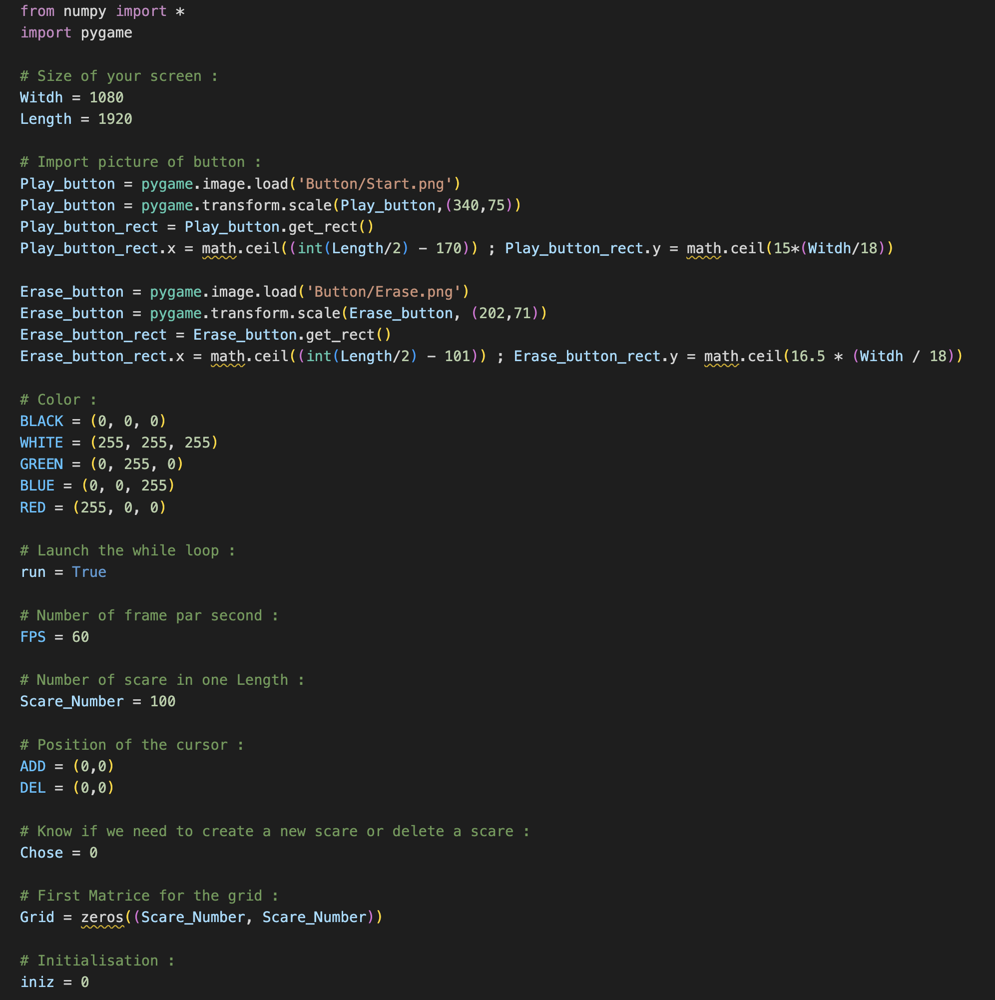

# Game Of Life in Python with Pygame

I made a **GAME OF LIFE** in python3 with Nympy and Pygame !  
If you don't know what is Game of Life, go check this [video](https://www.youtube.com/watch?v=Kk2MH9O4pXY)


## How it's work 

When you lauch the game, you can ERASE GRID or START SIMULATION. With Mouse when you use right click you erased a pixel and leght click you add one.


## How can you play

First, download all file and with a terminal run following command :

```python
pip3 install pygame numpy
# and
python3 Main.py
```

And after the you will have a fullscreen open and you only think you need it's to test the game !

## Make change with constante.py

If you open **constante.py**, you can modify all setting you want like FPS, Number of scare in one Length, Size of your screen...


